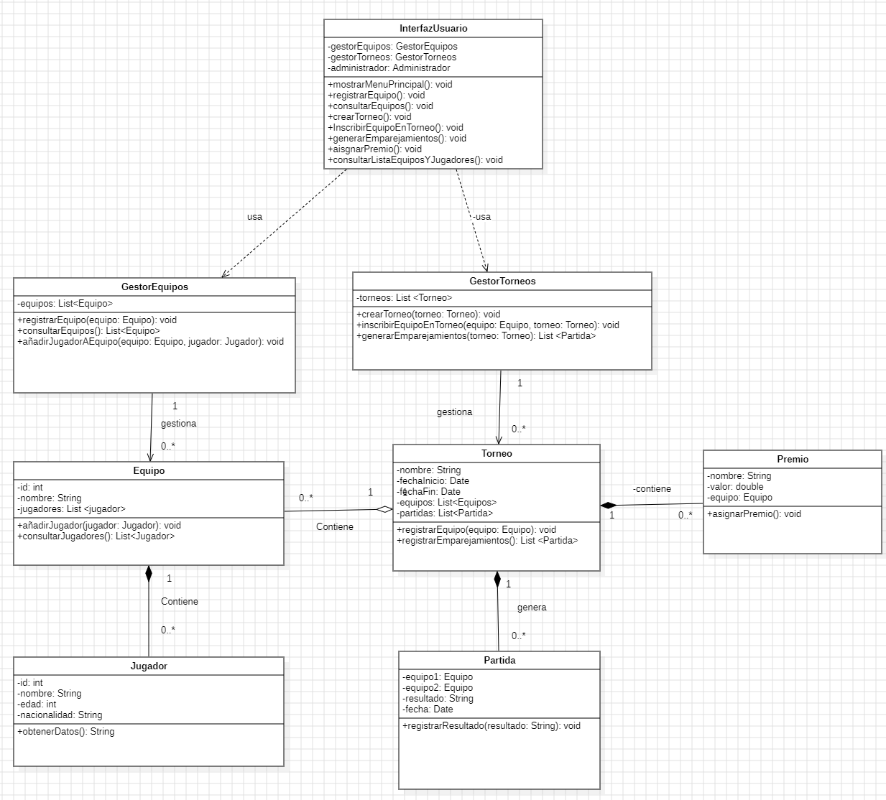

# Sistema de Gestión de Torneos de eSports

## Autor
Jorge Pacheco Pavón
Jorgekoke21

## Descripción del Proyecto

https://github.com/Jorgekoke21/torneo-esports-uml

Este proyecto implementa un sistema de gestión de torneos de eSports
utilizando UML para el modelado y Java para la implementación.

## Diagramas UML

Con la interfaz de usuario usamos los gestores de Torneos y equipos. Esto actua como administrador
Con estos gestores podemos crear toda la infomraicon correposnidente a los equipos y los torneos. 

Con los gestores, gestionamos todda la informacion de los equipos y de los torneos. Con ello observamos que tienen una relación de Asociación

En gestor de equipos, gestionamos toda la infomracion de Equipo. Equipo se relaciona con Jugadores mediante con una relación de Dependencia

Con el gestor de Torneos, agregamos la informacion de los equipos (relación de Agregación y creamos los partidos del Torneo (relación Dependencia)
y tambien generamos los premios y los asignamos al Torneo ( relación de Dependencia)

### Diagrama de Casos de Uso

Registrar equipo

Actor: Administrador. Es quien puede registrar la infomracion

- Registrar equipo: Permite al administrador crear un nuevo equipo ingresando sus datos

- Comprobar Si equipo está inscrito: Admin comprueba que se registró correctamente

- Validar los datos: Admin verifica en el sistema que todos los datos son correctos 

<<include>> : es obligatorio en el proceso, si no, se pararía el proceso 

Añadir Jugador a equipo del Torneo

Actor: Administrador. Es quien puede registrar la infomracion
	
Consultar lista de equipos y Jugadores: Admin consulta la Lista de equipos y sus jugadores

Filtrar por Torneo o Jugadores: Admin puede filtrar por Torneo para ver sus equipos.
				También puede filtar por jugador para ver en que equipo compite

<<Extend>>: depende de los torneos creados y de los equipos incritos con sus jugadores

Consultar lista de jugadores y torneos

Actor: Administrador, Equipo y Jugador. El adminitrador puede realizar consultas. Los equipos pueden realizar consultas sobre 
equipos y jugadores. El jugador tambien puede realizar las consultas

Consultar lista de equipos y Jugadores: Admin consulta la Lista de equipos y sus jugadores

Filtrar por Torneo o Jugadores: Admin puede filtrar por Torneo para ver sus equipos.
				También puede filtar por jugador para ver en que equipo compite

<<Extend>>: depende de los torneos creados y de los equipos incritos con sus jugadores

### Diagrama de Clases

clases de: Torneo, Equipo, Jugador, Partida y Premios

## Estructura del Proyecto
torneo-esports-uml/ ├── src/
│ ├── es/empresa/torneo/
│ │ ├── modelo/
│ │ ├── control/
│ │ ├── vista/
│ │ ├── Main.java
├── diagrams/
│ ├── casos-uso.png
│ ├── clases.png
├── README.md
├── .gitignore

## Instalación y Ejecución
1. Clonar el repositorio:
`git clone https://github.com/jorkekoke21/torneo-esports-uml.git`
2. Compilar y ejecutar el proyecto:
`cd src javac es/empresa/torneo/Main.java java es.empresa.torneo.Main`

## Justificación del diseño

Como dice el enunciado el proyecto cuenta de 3 paquetes:

El de modelo, con las clases de: Torneo, Equipo, Jugador, Partida y Premios

La logica de negocio con los Gestores de Equipos y Torneos

Y la vista, con el interfaz

Con la interfaz de usuario usamos los gestores de Torneos y equipos. Esto actua como administrador
Con estos gestores podemos crear toda la infomraicon correposnidente a los equipos y los torneos. 

Con los gestores, gestionamos todda la informacion de los equipos y de los torneos. Con ello observamos que tienen una relación de Asociación

En gestor de equipos, gestionamos toda la infomracion de Equipo. Equipo se relaciona con Jugadores mediante con una relación de Dependencia

Con el gestor de Torneos, agregamos la informacion de los equipos (relación de Agregación y creamos los partidos del Torneo (relación Dependencia)
y tambien generamos los premios y los asignamos al Torneo ( relación de Dependencia)

## Conclusiones

En este trabajo me sirvio para elaborar de forema visual un sistema de gestion, como organizar sus clases y sus relaciones en UML

Aprender sobre las relaciones que existen entre las clases como dependencias, Agregacion y Asociaciones.
Aprendí de dependencia: cuando una una clase necesita de otra, si se destruye una clase la otra desaparece
Sobre agregación, donde agrega una clase, pero puede existir de forma independiente. Si se destruye, puede seguir existiendo
Sobre asociaciones, done conecta clases, pero no existe dependencia unas de otras.

También sobre los casos de uso y los actores que intervienen , que serían las acciones que se pueden realizar por el Admin o diferentes usuarios
